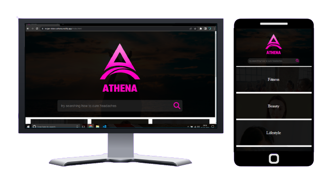

# ATHENA  

Athena is a web-application that provides one stop solution to all the problems that women face in their day to day life , ranging from queries related to their health to even beauty and fashion secrets. <br>
This is a project made by our team "Trojan Riders" for the "Inspirathon" conducted by NSUT.

## Demo
Deployed Website Link : https://trojan-riders-athena.netlify.app/

## Problem Statement
Problem Statement 1: <br>
“Healthcare accessibility isn’t a privilege to women
 it is a basic need and should be a priority”
<br> 
Nowadays women are at par with men in all spheres of life, they are working as
successful doctors, engineers, professionals, entrepreneurs etc. Women do not feel free
to talk about their health. In some cases it becomes life-threatening. Talking about
women related health issues is still a big taboo in most parts of India. Participants are
required to find a technical solution to solve the above problem.

## Run Locally
Clone the project
```bash
  git clone https://github.com/Trojan-Riders/Athena.git
```
Go to the project directory
```bash
  cd folder-name
```
Start the Server by double clicking on [index.html](index.html) file


## Tech Stack
**Client-Side:** 
- HTML
- CSS
- JavaScript

## API Reference
#### API 1
```http
  GET  https://rapidapi.com/datascraper/api/g-search/
```

| Parameter | Type     | Description                |
| :-------- | :------- | :------------------------- |
| `api_key` | `string` |This is used for suggesting health related question in the homepage |

#### Get item

```http
  GET https://rapidapi.com/newscatcher-api-newscatcher-api-default/api/free-news/
```

| Parameter | Type     | Description                       |
| :-------- | :------- | :-------------------------------- |
| `id`      | `string` | It is used for getting the blogs based on different catagories like Fitness,Beauty,Relationship and so on.|

## Screenshots



## Features
- Search Feature for all issues related to Women's health
- Blogs related to fashion ,fitness and other domains
- Responsive on all screens

